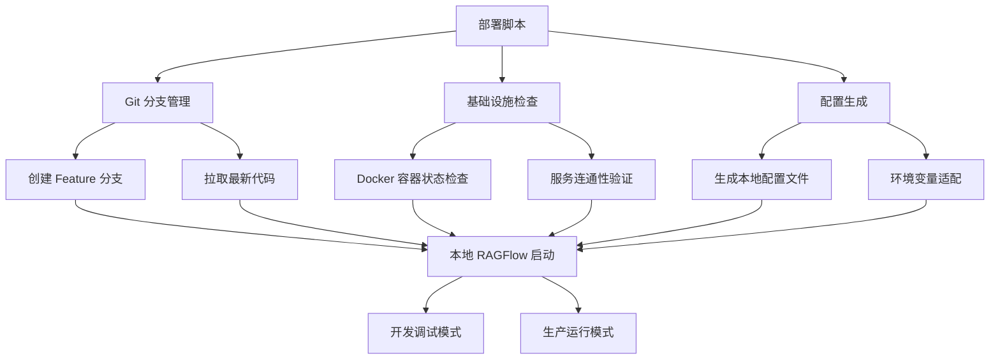

# 本地部署设计文档

## 概述

本设计实现 RAGFlow 系统的混合部署架构：基础设施组件（MySQL、Redis、MinIO、Elasticsearch）继续使用 Docker 容器，而 RAGFlow 主服务迁移到本地运行。这种架构既保持了基础设施的稳定性，又提供了主服务的开发灵活性，支持热重载、断点调试等开发特性。

## Steering 文档对齐

### 技术标准 (tech.md)
- **遵循现有技术栈**：Python 3.10-3.12、Flask、React 等保持不变
- **配置管理一致性**：使用相同的配置文件格式和环境变量
- **容器化基础设施**：复用现有的 Docker Compose 基础设施配置
- **开发工具集成**：支持 debugpy、热重载等开发调试功能

### 项目结构 (structure.md)
- **模块边界清晰**：部署脚本独立于业务逻辑
- **配置文件分离**：本地配置与容器配置分离管理
- **依赖管理规范**：使用 uv 进行 Python 依赖管理
- **分支管理策略**：在 feature 分支上开发，支持贡献到官方仓库

## 代码复用分析

### 现有组件复用
- **Docker Compose 配置**：复用 `docker-compose-base.yml` 中的基础设施定义
- **配置模板系统**：复用 `service_conf.yaml.template` 的配置模板机制
- **环境变量管理**：复用现有的 `.env` 文件和环境变量处理逻辑
- **配置解析模块**：复用 `api/utils/__init__.py` 中的配置读取和解密功能

### 集成点
- **配置系统**：与现有的 `api/settings.py` 和 `rag/settings.py` 集成
- **服务启动**：与现有的 `api/ragflow_server.py` 启动流程集成
- **健康检查**：复用现有的服务连接验证逻辑
- **日志系统**：与现有的日志配置和输出格式保持一致

## 架构

本地部署采用混合架构模式，将系统分为容器化基础设施层和本地应用层：

### 模块化设计原则
- **单一文件职责**：每个脚本文件处理特定的部署阶段
- **组件隔离**：基础设施管理与应用启动逻辑分离
- **服务层分离**：配置生成、环境检查、服务启动分层处理
- **工具模块化**：将通用功能抽取为独立的工具模块



## 组件和接口

### 组件 1：Git 分支管理器 (GitBranchManager)
- **目的**：管理 feature 分支的创建、代码同步和版本控制
- **接口**：
  - `create_feature_branch(branch_name)`: 创建 feature 分支
  - `sync_latest_code()`: 同步最新代码
  - `check_git_status()`: 检查 Git 状态
- **依赖**：Git 命令行工具
- **复用**：无（新组件）

### 组件 2：基础设施管理器 (InfrastructureManager)
- **目的**：管理 Docker 容器的启动、停止和健康检查
- **接口**：
  - `check_container_status()`: 检查容器状态
  - `start_infrastructure()`: 启动基础设施容器
  - `verify_connectivity()`: 验证服务连通性
- **依赖**：Docker、Docker Compose
- **复用**：现有的 `docker-compose-base.yml` 配置

### 组件 3：配置生成器 (ConfigGenerator)
- **目的**：生成适配本地部署的配置文件
- **接口**：
  - `generate_local_config()`: 生成本地配置文件
  - `adapt_container_addresses()`: 适配容器服务地址
  - `validate_config()`: 验证配置正确性
- **依赖**：环境变量、模板文件
- **复用**：现有的配置模板和解析逻辑

### 组件 4：本地服务启动器 (LocalServiceLauncher)
- **目的**：启动和管理本地 RAGFlow 服务
- **接口**：
  - `start_service(debug_mode=False)`: 启动服务
  - `setup_debug_environment()`: 配置调试环境
  - `monitor_service_health()`: 监控服务健康状态
- **依赖**：Python 环境、依赖包
- **复用**：现有的 `api/ragflow_server.py` 启动逻辑

## 数据模型

### 部署配置模型 (DeploymentConfig)
```python
class DeploymentConfig:
    - project_root: str              # 项目根目录路径
    - feature_branch: str            # Feature 分支名称
    - docker_compose_file: str       # Docker Compose 文件路径
    - local_config_file: str         # 本地配置文件路径
    - debug_mode: bool               # 是否启用调试模式
    - debug_port: int                # 调试端口号
    - container_ports: dict          # 容器端口映射
```

### 服务状态模型 (ServiceStatus)
```python
class ServiceStatus:
    - service_name: str              # 服务名称
    - status: str                    # 服务状态 (running/stopped/error)
    - container_id: str              # 容器 ID（如果适用）
    - host: str                      # 服务主机地址
    - port: int                      # 服务端口
    - health_check_url: str          # 健康检查 URL
```

## 错误处理

### 错误场景
1. **Git 操作失败**
   - **处理**：提供详细的错误信息和解决建议，支持手动处理冲突
   - **用户影响**：显示具体的 Git 错误和建议的解决步骤

2. **Docker 容器启动失败**
   - **处理**：检查 Docker 服务状态，提供容器日志信息
   - **用户影响**：显示容器启动失败的原因和修复建议

3. **配置文件生成错误**
   - **处理**：验证模板文件和环境变量，提供配置检查工具
   - **用户影响**：显示配置错误的具体位置和修正方法

4. **服务连接失败**
   - **处理**：提供连接测试工具，检查网络和端口配置
   - **用户影响**：显示连接失败的服务和网络诊断信息

5. **Python 依赖安装失败**
   - **处理**：检查 Python 版本兼容性，提供依赖安装日志
   - **用户影响**：显示依赖冲突信息和解决方案

## 测试策略

### 单元测试
- 配置生成器的模板处理和变量替换逻辑
- Git 分支管理器的分支操作和状态检查
- 服务状态检查和健康验证逻辑
- 错误处理和异常情况的处理流程

### 集成测试
- Docker 容器与本地服务的连接测试
- 配置文件生成与服务启动的端到端流程
- 不同操作系统环境下的部署兼容性测试
- 从 Docker 部署到混合部署的迁移测试

### 端到端测试
- 完整的部署流程：从代码拉取到服务启动
- 开发调试场景：热重载、断点调试功能验证
- 配置变更场景：环境变量修改后的服务重启
- 故障恢复场景：服务异常后的自动重启和恢复
